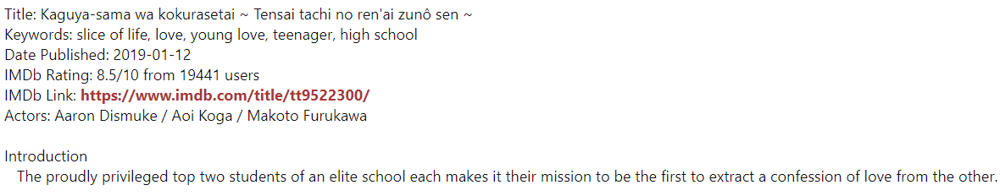
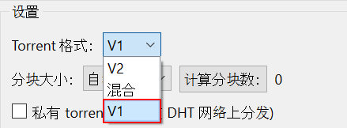
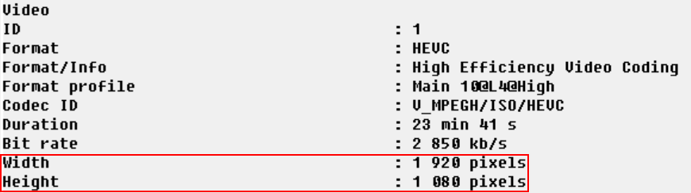

# 保姆喂饭级新手发种教程 - 主教程篇

## 1. 前言

> 本教程将同步发送到：百度贴吧PT吧，药丸论坛，友站教程区（教程发送者为jinqiangyu（全站同名）即为本人发布）  
> 本教程已经上传到Github＆Gitee，前往下载项目后使用markdown编辑器打开观感更好！（推荐VSCode搭配插件食用）（国内用户请移步Gitee下载）  
> Github项目地址：[https://github.com/jinqiangyu666/PT-Upload-Tutorial](https://github.com/jinqiangyu666/PT-Upload-Tutorial)  
> Gitee项目地址：[https://gitee.com/jinqiangyu666/pt-upload-tutorial](https://gitee.com/jinqiangyu666/pt-upload-tutorial)  

本篇教程为保姆喂饭系列第一期，这个系列主打以图文贴合实际，手把手的方式，辅以一些示例来帮助萌新学到一个实用的技能，**不会**涉及的过于深入，基本都是较为常用的知识点（进阶知识/冷门知识请辅以本教程名称进行搜素，***你就不能去bing一下吗？***），并且系列均为长篇教程，适合萌新们慢慢食用

本教程所有软件**均处于**Windows环境，并且**只考虑**Windows情况下的制作流程，其他系统请自行搜素

本教程**仅供**NexusPHP站点使用，Gazelle/TNode/UNIT3D等其他架构或外站请结合本教程，参考站点内教程规则进行发布

本教程适合以下人群：

- 初入PT圈不久，已经熟悉PT站的萌新玩家，希望学习发种技能
- 粗略学会发种的玩家，希望更进一步，学习如何规范发种
- ~~想吃到部分站点发种得到的多倍上传奖励的玩家~~
- 只是想看看一个种子与Info信息具体构成的玩家

本教程将分为主篇与附篇，主篇将分为多个章节，从零开始，详细讲述发种的每一步，附篇为FAQ篇，将列出一系列发种常见问题，并给出详细解答

**转载须知：**

**本人保留要求转发者删除转发贴的权利，并且文章版权归作者我本人所有**  
**本教程无论转载到何处（请注意下面禁转平台），必须向我本人私信说明后方可转载（转载哪个帖子，转载到何处，你的用户名），且不得更改原文内容！**  
**可向以下账号发送私信说明转载情况**  

- **贴吧账号：一条金枪鱼_**  
- **药丸账号：jinqiangyu**  

**同时请注意!本教程禁转以下平台：**

- **非PT交流处（如哔哩哔哩，知乎，CSDN，什么值得买等，与PT无关的论坛，博客，除PT吧外的其他所有吧）**  
- **跟我有纠纷的站点，论坛（目前应该没有，为防万一请以私信回复为准，如不允许请自行删帖）**  

**免责声明：**

**本教程所有涉及PT站点/PT小组图片的均已对网址，LOGO等进行打码处理，介绍均使用虚构PT站点/PT小组，如有雷同，纯属巧合**  
**对于自购扫描，网络录制等资源获取方式，本文不会介绍，本人也不对因此导致的各种后果负任何责任**  
**特殊情况以及具体细则请以站内发种规则为准，如遇删种/警告/封号，本人对此不负责任**  
**如有人看完本教程后将禁转/限转资源转发到别的站点，本人对此不负责任**  
**所有视频文件版权归属原作者所有，本文仅作介绍，请遵守国家各项法律，如需获取资源，请支持正版！**  

那么前言就写到这里，下面为正文阶段

## 2. 认识种子的结构

### 2.1 概览

既然想规范，正确的发布一个种子，首先要做的就是认识种子

一个规范的种子应该由下面几个部分组成：

- 主标题
- 副标题
- 转载信息（仅转载资源）
- 海报
- 简介
- Info信息
- 截图
- IMDB/豆瓣/PT-Gen链接（仅影视或游戏资源）
- 额外信息（如制作说明等）
- 标签/类型/质量（如果站点有的话）

下面是一个NexusPHP架构站点的种子的简单示例  
  
在上面的图中，我用红框标出了种子各部分的位置以及名称，接下来，我将结合上面的示例，讲解每个部分都是由什么构成的  

### 2.2 主标题

主标题是一个种子最重要的地方，一个完整的种子标题可以使下载者一眼就能看出这个资源的各项信息，它由下面这几部分构成：

- 资源名称（英文名）
- 发行年份
- 分辨率
- 来源
- 视频编码格式
- 音频编码格式
- 音频通道（无则默认为1.0）
- 制作人/小组
- 其他信息

上面是一个最基本的情况，如果资源为多集资源，则还会有：

- 季数/集数

还有一些常见的其他信息，比如：

- HDR信息（无则默认为SDR）（只写HDR默认为HDR10）  
  - HDR10（+）  
    
  - DV（杜比视界）  
    
  - DV HDR10（+）  
    

- 色深（无则默认8bit）  
  - 10bit  
    
  - Hi10P（满足SDR并且视频编码为AVC/H.264/x264的10bit资源需要写成这样）  
    
- 多语言配音（xAudio，除原盘外的其他资源如果有多种配音，这里就需要写）  
    
- REPACK（重新包装发布资源）（动漫压制圈内的Reseed一般来说也属于REPACK，遇到时写REPACK即可）  
    

种子主标题的这些部分也是有一定顺序的，一般来说，是按下面这样来排序：

`资源英文名称` `发行年份` `季数/集数（仅限剧集资源）` `REPACK（如果为REPACK资源）` `分辨率` `来源` `HDR（如果为HDR资源）` `色深（如果不是8bit色深资源）` `视频编码` `多语言配音（如果为多语言配音资源）` `音频编码` `音频通道` `制作人/小组`

一个完整的虚构示例：

`Ruozhiba Featured Joke Clips 2024 S1E1 REPACK 1080p BluRay DV HDR 10bit x265 4Audio DTS-HD MA 5.1-JQY@Ruozhiba`

但是眼尖的你可能已经发现，刚刚上面的几个标题好像有好几个都没有满足上面的命名顺序，有些发种人将某些部分换了位置，最多的就属`分辨率` `来源` `视频/音频编码`这几个，比如写成下面这样：

`资源英文名称` `发行年份` `季数/集数（仅限剧集资源）` `REPACK（如果为REPACK资源）` **`来源`** **`分辨率`** `HDR（如果为HDR资源）` `色深（如果不是8bit色深资源）` `多语言配音（如果为多语言配音资源）` `音频编码` `音频通道` **`视频编码`** `制作人/小组`

一个完整的虚构示例：

`Ruozhiba Featured Joke Clips 2024 S1E1 REPACK BluRay 1080p DV HDR 10bit 4Audio DTS-HD MA 5.1 x265-JQY@Ruozhiba`

这是因为，很多时候发种人并不会很严格的遵守上面的规则，而且0day标准的重编码，WEB等类资源标题就是视频编码后置（常见于外站），但内站仍采用0day标准的原盘，REMUX标题，具体的信息可以自行搜素，这里不过多赘述，**你只需要知道**：

1. `资源英文名称` `发行年份` `季数/集数（仅限剧集资源）` `REPACK（如果为REPACK资源）` 这个顺序是肯定固定的
2. `分辨率` 和 `来源` 有可能会互换位置，如果自己写标题而非转载的话就按`分辨率` `来源`这样写就OK了
3. 转种的情况下，如果其他部分如果跟上面的规则不一样，除了第一条不满足必须要改之外，其他部分可以适当允许位置更换，但 `分辨率`，`来源` 必须在种子标题的靠前面位置， `音频编码` `音频通道` 必须在种子标题的靠后面位置， `制作人/小组` 必须要在种子标题的最后

### 2.3 副标题

副标题较主标题来说规则并没有那么多，作为主标题的补充，一般来说，副标题会有以下部分

- 资源名称（中文名）
- 资源名称（源语言名称）
- 季数/集数（中文）（如为多集资源的某一单集）
- 导演/演员等（可选）
- 字幕/音频/章节信息（如有）
- 制作/转载信息（如有）
- 影片其他信息（可选）

下面给出几个实际的副标题示例：

- 电影  
  

- 剧集  
  

- 动漫  
  

其中，`资源名称（中文名）`是必须要有的，其他的部分绝大多数站点不做强制要求，不过如果有的话，还是推荐写上，能更加完善种子信息

虽然说副标题没有什么严格的顺序，但是还是推荐按照以下顺序来写：

`资源中文名称` `资源其他语言名称` `季数/集数` `导演/演员` `字幕/音频/章节信息` `制作信息` `影片其他信息` `转载信息`

其中，中文名称应该始终在副标题最前面，其他语言名称在中文名称之后，季数/集数跟在其他语言名称后面，转载信息应该始终放到最后

各种语言名称之间可以使用 `|` 或者 `/` 分隔开，其他部分之间亦可以使用 `空格` 或者 `|` 分隔开，`字幕/音频/章节信息`和`制作信息`还可以使用 `[]` 包裹住，但请注意，**不要使用全角符号分隔！**

下面是一个完整的虚构示例（~~*当然实际上一般没这么长*~~）：

`弱智吧精选笑话短片 / 弱智バー厳選されたジョーク短編映画 | 第一季 第一集 | 导演:弱智吧全体小吧 主演:弱智吧全体吧友 [国粤英日+评论音轨] [中英日多国特效字幕+原盘章节] [重新打包制作 内含原盘特典+扫图] 感谢弱智吧全体吧友参演 转自弱智吧字幕组`

### 2.4 转载信息

转载信息只有当你转载其他站的作品到另一个站时需要加上，其内容一般都很简单：

- 转载源站
- 感谢

转载信息在一般情况下都是写在简介的开头，且需要用引用标签 `[quote][/quote]` 包裹起来，一般还会使用加粗标签 `[b][/b]` 和颜色标签（一般转载信息为蓝色） `[color=Blue][/color]` 一并包裹起来

完整示例的BBCode代码为：

`[quote][b][color=Blue]转自弱智吧字幕组，感谢原作者发布[/color][/b][/quote]`

或者

`[quote][b][color=Blue]弱智吧官组作品，感谢原作者发布[/color][/b][/quote]`

### 2.5 海报

海报是每个种子都需要有的一个重要部分，部分站点会将简介中的首个图片作为海报，用以放在种子列表页显示

种子海报图在一般情况下必须是官方的海报图，例如豆瓣或者IMDB的海报图都算是官方的，如果没有官方的海报图，才能使用商品海报图（对于有蓝光/DVD发行的情况下）或者其他封面图，如果为软件/音乐/游戏资源等，你就需要动动手指，自行搜索一下图片，实在找不到可以使用有关的非官方海报图。获取到海报后使用图片标签 `[img][/img]` 包裹住海报的URL，放到转载信息的后面（没有转载信息就放到简介开头）

一个海报在简介中的BBCode代码示例：

`[img]https://example.org/example.jpg[/img]`

**注意**，图片标签里面的URL结尾肯定是以 `.jpg` `.jpeg` `.png` 或 `.webp`结尾的，如果URL结尾没有图片的文件扩展名，则这就不是一个正确的海报URL

### 2.6 简介

每个种子都需要有一个简介，用以介绍这个种子资源的具体信息，方便其他人查看和下载

如果是影视类资源，且有IMDB或者豆瓣的链接，那么可以直接利用PT-Gen生成种子的简介，生成的简介如下图：

- 豆瓣（一般豆瓣生成的简介都会直接带有海报图片）  
  

- IMDB  
  

一般情况下，内站都是采用豆瓣简介作为种子简介的，除非豆瓣没有这个资源的简介，才会使用bangumi，IMDB等生成简介。如果种子没有上面的链接，就需要自己动手编写简介，根据网上搜索到的信息进行编排，尽量保证简介中含有：

- 资源的名称（译名&原名）
- 资源发行的年份
- 资源发行的地区
- 资源的介绍

即可。如果可能的话，尽量丰富你的种子简介，这样能使下载者更加方便的选择资源

### 2.7 Info信息

Info信息在影视类资源里面是必须的（游戏，软件等其他类别一般无需填写），它可以让下载者明白这个资源里面视频的具体参数，同时还能帮助发布者填写种子的相关信息

在一般情况下，Info信息指的是以下两种软件所生成的视频文件信息：

- MediaInfo（除原盘/DIY类型资源的其他视频资源）[^链1]
- BDInfo（仅原盘/DIY类型资源）[^链2]

下面分别给出两种软件生成的Info信息的示例，图中同时展示了其中常用的一些部分的介绍：

- MediaInfo  
  

- BDInfo  
  

每个站点要求Info信息填写的地方各不相同，比如有在简介中以quote标签包起来的，隐藏标签 `[hide][/hide]` 包起来的，也有在种子发布页的Mediainfo栏中填写的（这个栏其实MediaInfo和BDInfo都可以填写），具体要求可以看站点相关的规则

一般来说，种子的各种质量信息都是从Info信息中提取出来后填写的，比如分辨率，编码，音频，字幕等，详细的提取过程将会在发种实践章节中介绍，这个章节仅用图片对Info信息的常用部分做一个简单的介绍

### 2.8 截图

每个站点对截图的要求都不一样，下面的介绍仅为一般情况下种子截图的要求

一般来说，每个视频类型的种子都需要起码3张的原始分辨率截图，上传到一个稳定的图床后放到简介的最后（有的站点还会有官方的图床），然后使用img标签将链接包裹起来，如果复制的链接已经带了img标签，就不需要额外包裹住了

一个完整的截图部分BBCode示例：  
`[img]https://example.org/example1.jpg[/img]`  
`[img]https://example.org/example2.jpg[/img]`  
`[img]https://example.org/example3.jpg[/img]`  

**注意**，图片标签里面的URL结尾肯定是以 `.jpg` `.jpeg` `.png` 或 `.webp`结尾的，如果URL结尾没有图片的文件扩展名，则这就不是一个正确的截图URL

### 2.9 IMDB/豆瓣/PT-Gen链接

大部分站点都会要求影视类资源在填写种子信息的时候带上IMDB/豆瓣/PT-Gen链接，具体应该填写哪些链接应该看站点发种页面的链接那一栏

IMDB，豆瓣是国内外知名的影视资源信息网站，只要资源有上面网站的信息就应该填写。PT-Gen是一个根据各种资源信息网站链接自动生成简介的工具，里面可以填写IMDB，豆瓣，bangumi（番剧），indienova（游戏）等的链接

各个资源信息网站链接示例：

- IMDB  
`https://www.imdb.com/title/tt9522300/`  

- 豆瓣  
`https://movie.douban.com/subject/30241099/`  

- bangumi  
`https://bgm.tv/subject/248175/`  

- indienova  
`https://indienova.com/game/a-dance-of-fire-and-ice`  

### 2.10 额外信息

额外信息一般来说不是必要的，但是如果有的话也还是推荐写上

一般来说，额外信息包含：

- 制作说明
- 源资源提供者
- 资源播放/使用测试
- 作者声明（如禁转，限转等）
- ~~*吐槽*~~（部分站点不允许，详细请看站点规则）

上面的信息一般使用quote标签包裹起来，放到简介的后面，当然，有些站点可能对其作特殊要求，具体请看站点规则

### 2.11 标签/类型/质量

每个站点的标签/类型/质量都不一样，有的站点可能只有针对影视类资源的标签/类型/质量，有的站点则可能针对其他类型的资源也有标签/类型/质量，其他类型的标签/类型/质量具体填写请参考站点内规则，下文仅介绍一般情况下的影视类资源的标签/类型/质量

类型一般分为：

- 电影
- 电视剧
- 动漫
- 动画
- MV（单曲对应的音乐短片）
- 演唱会
- 综艺
- 纪录片
- 戏剧
- 体育

等，部分站点可能会要求动漫电影归为动漫一类

质量一般会包含：

- 媒介：指资源载体的类型，如BluRay（BD原盘），REMUX（蓝光盘重混流），Encode（压制），WEB-DL（网络下载）等
- 视频编码：指视频所使用的编码格式/编码器，如H.264，x264，AVC，MPEG-2等
- 音频编码：指音频所使用的编码格式，如DDP（DD+，EAC-3），DTS-HD MA，FLAC，AAC等
- 分辨率：指视频的帧大小：如1080p（1920x1080），720p（1280x720），480p（854x480）等
- 地区：指资源发行的地区，如CN（中国大陆），JP（日本），US（美国），EU（欧洲）等

质量类型填写均需要参考MediaInfo或者BDInfo的数据，地区需要为资源最初发行的地区

标签一般都会有：

- 限转：在一定时间内禁止转发这个种子
- 禁转：禁止转发这个种子
- 首发：制作者在这个站点最先发布这个种子
- 国语：种子内包含国语音轨（仅限影视类资源）
- 粤语：种子内包含粤语音轨（仅限影视类资源）
- 中字：种子内包含中文字幕（仅限影视类资源）

上面的标签需要根据资源实际情况填写，资源文件夹内有外挂的中文字幕也可以使用中字标签，至于手动往站点上传的中文字幕则需要根据站点规则决定是否需要使用中字标签

### 2.12 认识种子的结构 章节尾声

在上面的章节中，我们认识了一个标准NexusPHP架构站点下的种子，了解了种子的每个部分，也明白了填写的规范，认识种子的结构 这个章节到此就结束了

下一个章节，我们将根据一个实际存在的资源来演示实际发布种子的每一步流程，并介绍一些发布种子时需要注意的点以及容易踩进去的坑，建议各位PTer同样下载下来这个资源，跟着教程一起做一遍（**但是不要按下发布按钮**！因为可能站点内已经有了这个种子！），在实践过程中学会如何发种

## 3. 开始实践发布种子

### 3.1 进行查重

在发布种子之前，请**务必一定一定要进行查重操作！！！**，如果**不进行查重可能会导致删种，警告，撤销发种权限等处罚！！**

如果你安装了auto_feed脚本来转发种子，那么只需要勾选上脚本区域的查重选择框，然后点击需要转发的站点即可。如果没有安装auto_feed，或者资源没有像IMDB/豆瓣等可以确定资源本身的相关ID，就需要手动进行查重，尽量使用多种语言名称搜索主/副标题，查看大小与本地资源相差不大的种子，同时注意主标题后面的组名是否匹配，如果发现相同的种子应该下载下来辅种，而不是将这个种子再一次发布到站点上

本教材使用的资源一般来说在较为大的站点上都已经被发布过了，这时候如果你跟着教程走就**不要按下发布按钮**，另外寻找一个没有被发布过的资源再根据站点规则及本篇教程进行发布，如果小站点没有发布，并且你已经掌握了该站点的详细发布规则，则可以尝试点击发布按钮进行发布，同时确保自己能持续做种直到出种（具体做种时间请看站点规则）

### 3.2 资源的获取

一般来说，资源获取主要有3个来源，分别是：

- 他站转发
- 公网动漫压制组
- 自购/自抓/自压/自DIY/自REMUX

在这篇教程中，因为版权和篇幅问题，不介绍第三条，主要以第二条为主，将压制组范围仅限制在动漫这一分类下主要还是因为FGT，RARBG等组的作品由于各种原因被各大PT站禁转，而动漫压制组下的如VCB-Studio，SnowRaws，ANK-Raws等相对来说与各大PT站都没啥纠纷（当然并不是与每个站都没有纠纷，具体请看规则是否允许发布公网资源，以及论坛是否有相关的说明，已知[VCB组禁转](https://vcb-s.com/archives/13120)，具体事件本文不做介绍以及评价）同时质量也满足PT的要求。综上，本教程将使用下面几个来自VCB-Studio的作品来作为示范：

剧集：

- [天使降临到我身边!](https://vcb-s.com/archives/11013)

电影：

- [你的名字。（10-bit 1080p版本）](https://vcb-s.com/archives/6658)

建议各位PT玩家们将这两个资源下载下来，然后跟着下面的教程一步一步走，体验一下具体的发布流程（**记得不要真的按下发布键！**）

你问如何下载？打开上面的链接，点击下图中红框位置的链接（~~*如果打不开说明需要一些魔法力量的加持*~~ 或者看看你手头有的站有没有资源）  
  
在这个新的页面中下拉到最底下，点击红框内的TORRENT按钮  
  
下载下来Torrent文件后，进入qBittorrent，选择下载目录后开始下载，等待下载完成就可以跟着教程继续走了  

### 3.3 获取MediaInfo/BDInfo

下载完资源后，首先要做的就是获取资源的MediaInfo（普通视频文件）或者BDInfo（原盘），你可以在这里下载到这两个软件：

- MediaInfo：[https://mediaarea.net/zh-CN/MediaInfo](https://mediaarea.net/zh-CN/MediaInfo)  
- BDInfo：[https://github.com/UniqProject/BDInfo](https://github.com/UniqProject/BDInfo)  

当然，我也提供了一份度盘分流，如果你打不开上述的网站，可以前往下面的百度网盘地址进行下载

百度网盘地址（链接已经携带提取码）：[https://pan.baidu.com/s/1NlSL8pF1Ge34Bpd-ws62aA?pwd=jqy6](https://pan.baidu.com/s/1NlSL8pF1Ge34Bpd-ws62aA?pwd=jqy6)

#### MediaInfo安装方法

下载后你会得到一个exe文件，双击打开它  
  
选择安装语言  
  
选择安装路径（可以保持默认）后点击安装按钮  
  
安装完毕后在Windows菜单就可以看到MediaInfo了，拖拽到桌面就可以创建快捷方式  

#### BDInfo安装方法

前往Github链接，点击页面右边的Releases，选择最新的一个版本，点击Assets，下载win-x64的版本。如果图方便可以直接下载我提供的度盘分流里面的BDInfo，下载完毕后解压到文件夹里面  
  
双击BDInfo.exe即可打开  

#### 获取视频文件的MediaInfo

打开MediaInfo，在顶部菜单栏选择File --> Open --> File  
  
资源如果是剧集，就选择剧集的第一集生成MediaInfo  
  
资源如果是电影，就选择主MKV文件生成MediaInfo  
  
选择完成后你会发现，MediaInfo默认的显示格式跟你在站点上看到的并不一样，这是因为MediaInfo处于Basic显示模式，所以让我们点击顶部菜单栏的View，然后选择Text模式  
  
这时候就能发现，MediaInfo已经处于Text显示模式了，双击显示的文字，然后使用快捷键 `CTRL + C` 复制，就获取到MediaInfo了  

#### 获取原盘的BDInfo

打开BDInfo，点击右上角的Browse按钮，选择你的原盘文件夹（即为BDMV文件夹）  
  
这时候你会发现，怎么所有的视频轨都没有Bit Rate（码率），这是因为还没有扫描这个原盘，所以需要我们勾选体积最大的一个MPLS，接着点击下面的Scan Bitrates按钮  
  
等待下方绿条走完并且弹出Scan completed successfully窗口（如果原盘体积较大可能会需要一些时间），就说明扫描完成了，然后点击窗口上的确定按钮  
  
接着点击下方的View Report按钮，在弹出的BDInfo Report窗口中选中从 `DISC INFO:` 到 `AUDIO:` 结束的内容（如果原盘含字幕则需选到 `SUBTITLES:` 结束，需要注意，请将 `AUDIO:` 或者 `SUBTITLES:`这个章节全部选中），接下来使用快捷键 `CTRL + C` 复制即可获取到BDInfo了  
  

### 3.4 制作种子

现在资源和Info信息都已经到手了，该开始制作资源的种子了。如果你只使用auto_feed脚本转发种子，那么无需执行这一篇章的内容，auto_feed会自动为你处理原本的种子文件，现在的大部分内站都会自动转换Torrent内的Tracker URL信息，一般来说无需担心出现无法做种的现象

如果你是从类似于VCB这样的公网来源获取到的资源，或者在外站发种，则需要手动制作种子，下面我将使用qBittorrent[^链3]来演示制作种子的过程

首先打开qBittorent，在顶部菜单栏选择工具 --> 生成Torrent  
  
在弹出的页面中，如果资源有多个文件，并且资源都在在一个文件夹里面，就点击选择文件夹按钮，选择资源文件夹。如果资源只有一个文件，且文件外没有文件夹（如果有文件夹仍然点击选择文件夹按钮）则点击选择文件按钮，选择资源文件  
  
接下来需要查看发种站点的Tracker URL，进入你需要发种的站点的发布页面，在种子信息表格的最上面就是Tracker的URL，将它选中并复制下来  
  
现在回到qBittorrent，将设置里面的 `私有 torrent （不会在DHT网络上分发）` 选项勾选上，然后将刚刚复制的Tracker URL粘贴到字段内的 `Tracker URL:` 文本框内，再次确认一遍路径是否正确后就可以点击最底部的 `制作 Torrent` 按钮了  
  
在新弹出的窗口中选择自己生成的Torrent文件存储的位置，然后就可以点击保存按钮了  
  
之后等待底部的绿色进度条走完，弹出窗口后，点击确定按钮，就能在上面的位置找到种子文件了  
  
到此，种子就制作完毕了，你就可以在发布页面的种子信息表格中的种子文件一栏中，选择刚刚制作好的种子文件并上传了  

### 3.5 填写主标题

既然种子文件已经生成完毕，该来填写种子信息表格中的内容了，首先要填写的就是主标题

主标题的具体填写细则请参考 `2.2 主标题` ，下面我们将根据这个章节来填写示例资源的主标题

#### 查找资源名称与发行年份

主标题的开头就是资源的英文名与资源的发行年份，这些信息需要我们到IMDB/TMDB/豆瓣/bangumi等网站使用资源文件自带的名称进行搜索，找到对应的条目后按照条目内的英文名和发行年份进行填写，优先填写官方英文名，如果无官方英文名则可使用诸如日语罗马字等进行填写，懒得判断就看IMDB上面写的是什么填什么就行，注意需要保留标点符号！

这里更推荐使用[TMDB](https://www.themoviedb.org/)和[IMDB](https://www.imdb.com/)进行官方英文名称的搜索（~~*如果打不开说明需要一些魔法力量的加持*~~）。但是无论使用哪个网站搜索，我们都需要先知道资源的一个名称，这时候就可以找到下载到本地的资源，查看文件夹名称  
  
然后就能获取到资源发布者提供的名称：  

- `Watashi ni Tenshi ga Maiorita!`
- `Kimi no Na wa. -your name.-`

这个名称可能不准确，但是提供的信息足够让我们在其他平台搜索到正确的资源名称了（搜不到可以拆分一下单词搜索）

TMDB查找并获取示例：

- 天使降临到我身边!  
打开TMDB，使用上面获取到的名称 `Watashi ni Tenshi ga Maiorita!` 进行搜索，在搜索结果中需要选择 `剧集` （如果是电影等单个视频则需选择 `电影`），找到符合本地资源的条目后点击  
  
在打开的条目页内上方，选择概览 --> 翻译  
  
进入条目的翻译页面后，下拉找到 `英语 (en-US)` 表格，表格中的Name一行就是资源的英文名称，将它选择并复制下来即可  
  
资源的发行年份可以在条目页内直接找到，就在标题的右边  
  
获取完了这些信息后记得**保留网页**，教程的后面可能还会使用  

IMDB查找并获取示例：

- 你的名字。  
打开IMDB，在网页最顶部的搜索框中输入上面获取到的名称 `Kimi no Na wa. -your name.-` 并搜索，在Titles中找到符合本地资源的条目后点击（如果没找到可以点击More popular matches获得更多有关搜索内容的条目）  
  
打开的条目页内的标题就是资源的英文名称，将它选择并复制下来即可，如果有英文译名的资源标题显示罗马字，点击页面右上角的EN切换到别的语言再切换到EN即可，还是罗马字就说明资源没有英文名，复制罗马字标题即可  
  
资源的发行年份可以在条目页内直接找到，就在Original title下面  
  
获取完了这些信息后记得**保留网页**，教程的后面可能还会使用  

#### 查找多集资源的季数/集数

由于上面只有 `天使降临到我身边!` 为多集资源，所以将同时使用TMDB和IMDB演示如何获取这个多集资源的季数/集数

**注意！只有资源为某一季中的某一集才需写明季数与集数（即S1E1，E1代表是这一季的第一集，不是这一季只有一集！），如果资源为完整的一季则无需填写集数（即S1这种写法）！如果资源已经完结，大部分站点就不允许发布完结的这一季中的一个单集资源！**

如果资源只有一季且已完结，则可以不写季数（本文为了示范仍然写上），**如果资源只有一季但是正在持续更新，则需写上完整的季数与集数**

这里假设你已经按照上面的教程，在TMDB和IMDB上找到了 `天使降临到我身边!` 的条目并保持打开状态

TMDB查找季数/集数示例：

- 天使降临到我身边!  
在资源条目页内上方，选择概览 --> 季  
  
这里能发现，这个资源有两个季，但是有一个季是特别篇（TMDB将其录为第0季），一般来说我们会忽略它，不将这个特别篇视作一季（资源内直接当第13集OVA处理了），然后就只有第一季了，所以我们判断，这个资源只有一季。接下来我们点击第一季  
  
点进第一季的页面后，能在页面上方看到 `集 12` ，说明这一季内总共有12集（~~其实你在季页面也能看到这一季有多少集~~），页面下面都是每一集的介绍，如果一个资源还在持续更新，你可以依靠对比图片来判断本地资源是哪一集  
  

IMDB查找季数/集数示例：

- 天使降临到我身边!  
点击资源条目页中间的 `Episodes`  
  
在进入的Episode list页面中，点击页面中间的Seasons选项，就能看见下面有一些圆点（或者椭圆点），圆点内的数字代表这是第几季，能看到只有一个带1的圆点，代表这个资源只有一季，至于那个Unknown实际上就是刚刚上面所说的特别篇，我们忽略它即可。页面下面则是这一季每一集的介绍，如果一个资源还在持续更新，你可以依靠对比图片来判断本地资源是哪一集  
  

#### 判断资源的来源

一般来说，你无法仅凭本地的视频文件确定一个资源的来源，需要依靠资源的发布页面，资源自带的名称等进行判别。当然，如果你是转种，一般来说发种者会在标题上写明资源的来源，比如BluRay或者WEB-DL等，直接将其复制下来即可。下面主要讲述的还是，如果是公网资源，该如何查找来源

在具体的操作之前，必须先记住一些要点：

来源指的**是**：BluRay（UHD BluRay），DVD，DVDRip，WEB-DL，WEBRip，HDTV（UHD TV），HDTVRip（UHD TVRip）等，还有一个特殊的REMUX，必须加在BluRay（UHD BluRay）或DVD的后面，不能单独使用

来源指的**不是**：BD DIY，REMUX（单独只有一个REMUX的情况下），Encode

另外，在动漫资源站（如NYAA和各大公网压制组官网）中经常能看到BDRip，但是在0day命名中，这代表采用压制后的源进行二压后的作品，显然一般情况下这些站点发布的都不是这种资源，所以我们需要对其进行更正，将来源改为BluRay即可

从公网下载下来的资源需要观察文件名/发布页面标题是否包含上述来源字样，观察文件夹结构是否是原盘/DVD结构（如果是原盘/DVD结构那么可以判断来源肯定是BluRay/DVD），观察文件码率（发现MKV文件视频码率基本都在几十M左右，可以考虑是否为REMUX），观察视频水印（如果有哪家流媒体的水印即可判定为WEB-DL或者WEBRip，电视台同理）

#### 从MediaInfo/BDInfo中获取视频/音频信息

现在，让我们拿出在3.3章节获取到的MediaInfo/BDInfo，我们需要获取其中的一些信息用以填写主标题：

- 分辨率
- 视频编码格式
- 音频编码格式
- 音频通道
- HDR信息（如有）
- 色深
- 多语言配音（如有）

MediaInfo获取所需信息示例：

- 天使降临到我身边!
  - 获取分辨率  
    查看MeidiaInfo中 `Video` 的 `Width` 和 `Height` ，它们分别代表着视频帧的宽度和高度，这个资源宽1920像素，高1080像素，代表分辨率前面肯定是1080 （同理，1280x720前面就是720，2560x1440前面就是1440，3840x2160前面就是2160，如果遇到切了黑边或者长度与标准差不太多的电影，高度变为900或者其他，仍然算作1080，其他同理）  
      
    我们还需要查看这个资源是1080**i**（ `interlaced scan` 交错式扫描 ）还是1080**p**（ `progressive scan` 逐行扫描 ），`i` 和 `p` 的区别你可以简单理解为 `i` 画面质量差，占用带宽少，`p` 画面质量好，占用带宽多。现在介绍完了，就让我们来学习一下如何根据MediaInfo来判断资源是 `i` 还是 `p` 吧  
    查看MediaInfo中 `Video` 内是否有 `Scan type` ，如果没有的话，一般来说资源就是 `p` ，如果有，则需要看 `Scan type` 是什么，如果是 `Interlaced` 即为 `i`  
      
    如果是 `Progressive` 或者没有 `Scan type` 则为 `p`  
      

    观察 `天使降临到我身边!` 本地资源MediaInfo（本小节图1和图3下图）即可知道，这个资源为1080p  
  - 获取视频编码格式  
    查看MediaInfo中 `Video` 的 `Format` ，一般来说是AVC或者HEVC，其他的编码格式比较少见，这里不作赘述  
      
    仅凭 `Format` 是没有办法确定实际的编码器的，所以我们还需要查看MediaInfo里面是否有 `Writing library` ，如果有则还需要查看它来确定具体的编码器，比如x264或者x265  
      
    如果没有 `Writing library` 且资源**是**原盘或REMUX则可确认为AVC或者HEVC  
    如果没有 `Writing library` 但资源**不是**原盘或REMUX则可确认为H264或者H265  

    观察 `天使降临到我身边!` 本地资源MediaInfo（本小节图1和图2）即可知道，这个资源为x265  
  - 获取音频编码格式  
    查看MediaInfo中 `Audio` 的 `Format` ，一般来说这里就是需要写的资源的音频编码，如FLAC，AAC等  
      
    但是有些编码拥有好几个名称，比如DD（AC-3，全称Dolby Digital），DDP（DD+，E-AC-3，全称Dolby Digital Plus），遇到这些编码我们就可以看MediaInfo的 `Commercial name` （商业名称） 确定具体使用哪一个，写它的缩写即可，比如 `Commercial name` 是 `Dolby Digital Plus` ，我们写DDP即可  
      
    如果资源有多个音轨，则挑选音频通道最多的那个无损音轨即可，如果没有无损音轨，则挑选有损音轨中音频通道最多的那个即可，不用区分是不是配音音轨  
    常见的无损音轨有：
    - FLAC
    - TrueHD
    - DTS-HD MA
    - LPCM（PCM）

    常见的有损音轨有：
    - AAC
    - DD（AC-3）
    - DDP（DD+，E-AC-3）
    - DTS
    - MP3

    观察 `天使降临到我身边!` 本地资源MediaInfo（本小节图1）即可知道，这个资源为FLAC  
  - 获取音频通道  
    查看MediaInfo中 `Audio` 的 `Channel(s)` ，这里就是这条音轨声道的数量，下面的 `Channel layout` 则代表了这条音频轨道都包含了哪些声道，如L（Left），R（Right），C（Center）  
      
    如何判断一个音轨是1.0，2.0，5.1还是7.1呢？  
    查看 `Channel(s)` ，一般来说，1.0就只有一个声道，2.0只有两个，5.1有6个，而7.1有8个。5.1和7.1其中的.1为超低音，也是一个单独的声道，所以5.1是6条，7.1是8条  

    观察 `天使降临到我身边!` 本地资源MediaInfo（本小节图1）即可知道，这个资源为2.0  
  - 获取HDR信息  
    查看MediaInfo中 `Video` 的 `HDR format` ，如果没有 `HDR format` 则代表这个资源不是HDR10（HDR10+）或者DV（或者两者）（有例外，如HLG，PQ10这两种少见的HDR在MediaInfo中并没有 `HDR format` ），如果有，我们就需要查看 `HDR format` 来确定具体的HDR格式  
      

    观察 `天使降临到我身边!` 本地资源MediaInfo发现没有 `HDR format` ，也不是HLG或PQ10，所以认定为SDR  
  - 获取色深信息  
    色深的获取非常简单，查看MediaInfo中  `Video` 的 `Bit depth` ，就能看到视频的色深，一般是8bit或者10bit  
      

    观察 `天使降临到我身边!` 本地资源MediaInfo（本小节图1）即可知道，这个资源为10bit  
  - 获取多语言配音信息  
    看资源是否为多语言配音，首先看MediaInfo中有几条 `Audio` ，如果只有1条直接跳过这个阶段，如果有2条及以上，则需要查看每条 `Audio` 的 `Language` ，如果都为同一语言则无需填写（这里请注意，需要将各地的方言（包含中国和外国）也算作一种语言，比如需要将普通话（Mandarin）和粤语（Cantonese）分开当作两种语言，各地自配音也算作一种语言，如央视国配，东影国配），如果语言不一样就看有几种语言写几Audio，比如一个资源拥有4条 `Audio` ，2条为英语（仅音频编码不同），1条为普通话，1条为粤语，就需要写 `3Audio`  

    观察 `天使降临到我身边!` 本地资源MediaInfo发现只有1条 `Audio` ，所以无需填写多语言配音  

BDInfo获取所需信息示例：

- （特殊示例）来自某站的Miku Symphony 2020 蓝光原盘
  - 获取分辨率  
    BDInfo相较于MediaInfo获取分辨率就很简单了，直接查看 `VIDEO` 的 `Description` ，第一个就是原盘的分辨率了  
      

    观察 `Miku Symphony 2020` 本地资源BDInfo（本小节图1）即可知道，这个资源为1080i  
  - 获取视频编码格式  
    查看BDInfo中 `VIDEO` 的 `Codec`，如果资源是普通BD（Blu-ray Disc），编码只会是MPEG-2，VC-1或者MPEG-4 AVC（后者标题中只需要写AVC即可），如果资源是UHD（Ultra HD Blu-ray），编码只会是MPEG-H HEVC（标题只需要写HEVC即可）  
    BD示例：  
      
    UHD示例：  
      

    观察 `Miku Symphony 2020` 本地资源BDInfo（本小节图1）即可知道，这个资源为AVC  
  - 获取音频编码格式  
    查看BDInfo中 `AUDIO` 的 `Codec`，就能知道原盘的音频编码格式，如果资源有多条音轨，根据上面MediaInfo的 `获取音频编码格式章节` 来确定具体要写的是哪一条音轨即可  
      

    观察 `Miku Symphony 2020` 本地资源BDInfo（本小节图1）即可知道，这个资源为LPCM  
  - 获取音频通道  
    查看BDInfo中 `AUDIO` 的 `Description`，第一个就是这条音轨的通道  
      

    观察 `Miku Symphony 2020` 本地资源BDInfo（本小节图1）即可知道，这个资源为2.0  
  - 获取HDR信息  
    只有UHD原盘才会有HDR，BD是没有的，如果资源是BD可以直接跳过这个阶段  
    查看BDInfo中 `VIDEO` 的 `Description` ，下图红框里面就是HDR的信息  
      

    `Miku Symphony 2020` 为BD而非UHD，所以为SDR  
  - 获取色深信息  
    看原盘的色深只用看资源是BD还是UHD即可，BD为8bit，UHD为10bit，也因此，原盘无需填写色深信息  

    `Miku Symphony 2020` 为BD而非UHD，所以为8bit，标题上无需填写  
  - 获取多语言配音信息  
    原盘不适用多语言配音，无需填写  
  - （**特殊**）原生原盘的地区  
    如果你的原盘是原生的，且在多个地区均有发行，那么需要注意，标题需要带上地区（如HKG，GER等），放在分辨率的后面即可  

#### 获取制作人/小组 & 剩下的信息

我们在上一个章节已经把大部分需要的信息拿到手了，现在还剩下制作人/小组和REPACK的判定，这两个都无法依靠本地资源来判断，有的资源可能在名称的最后会写上资源的制作人/小组，REPACK也可能会在名称中出现。如果你无法在名称中找到这两个信息，就需要去资源的发布页看看，如果真的找不到这两个信息，就无需在标题中填写了，大部分可能是纯公网资源，没法找到制作者

Tips：

- VCB发布页常见的Reseed在0day中即为REPACK，标题中使用REPACK即可
- 制作人/小组里的-和@有以下几种使用方法

  - -制作组
  - @制作组
  - -制作人@站点/制作组（斜杠代表或者）
  - -制作人

#### 组装主标题

我们现在已经获取到了所有主标题需要的信息，现在该组装到一块并填写了，下面将分别给出示例的两个资源的主标题（由于你的名字在获取大部分信息时与另一资源过程相差不大，为缩短篇幅省略了一些过程，依据教程获取信息后在此对照即可）：

- 天使降临到我身边!  
  `WATATEN!: an Angel Flew Down to Me` `2019` `S1` `1080p` `BluRay` `10bit` `x265` `FLAC` `2.0` `-VCB-Studio`  

- 你的名字。  
  `Your Name.` `2016` `1080p` `BluRay` `10bit` `x265` `FLAC` `2.0` `-VCB-Studio`  

### 3.6 填写副标题

我们在前面的章节中已经将主标题填写完毕，现在是时候来填写副标题了。副标题相较于主标题来说填写比较简单，而且一些需要的信息我们已经在获取主标题的时候就已经拿到了

#### 获取资源中文/源语言名称

现在让我们拿出在3.5章节第一小节中拿到的TMDB/IMDB链接，打开网页，根据下面的教程来查找中文名称

TMDB：

- 天使降临到我身边!  
根据3.5章节第一小节TMDB的部分进入到条目的翻译界面，下拉找到 `汉语 (zh-CN)` 表格，表格中的Name一行就是资源的英文名称，将它选择并复制下来即可  
  

IMDB（中文名称并不全，如果条目没有可以转到TMDB或者豆瓣搜索）：

- 你的名字。  
进入IMDB条目页面后，点击资源发行年份那里，进入Release info页面  
  
找到 `Also Known As (AKA)` ，点击 `All` 查看全部别名  
  
找到 `China` 一栏（如果没有说明IMDB没有录入，转到TMDB或者豆瓣搜索就行），确认后面有 `(Mandarin)` 且为汉字形式，将它选择并复制下来即可（不包含 `(Mandarin)` 部分）  
  

获取源语言名称流程跟上面基本一致，查看资源的发行地，然后按照上面的流程找到发行地对应的语言名称即可，如 `天使降临到我身边!` 发行地是日本，源语言找到日语（Japanese），就可以知道源语言名称即为 `私に天使が舞い降りた！`  

#### 获取季数/集数

**请注意**！只有一个多集影视的单集资源才需要填写季数/集数，需要按照3.5章节第二小节确定本地资源的所属季数以及集数，然后使用类似 `第x季第x集` 这种写法以及 `第x季第x-x集` ， `第x-x季`（跨季打包请注意站点规则是否允许发布） 这种写法，阿拉伯数字和汉字都可以使用  
**如果为整个单季资源或者非多集资源，无需填写这个部分**  

#### 获取字幕/音频/章节信息

现在让我们拿出来在3.3章节中获取到的MediaInfo和BDInfo，查找我们需要的字幕/音频/章节信息  
如果资源内包含了外挂字幕，一般也视作含有字幕  

MediaInfo：

- 字幕  
  查看MediaInfo中 `Text` 的 `Language` 和 `Title` （可能没有），来确定字幕的语言，如果有 `Title` ，则还可以看有没有类似双语字幕（比如CHS&ENG），特效字幕之类的字眼  

  - 字幕语言（如中字，中英双字，简繁日英字幕）
  - 特效字幕（如特效字幕，特效中字，中英双语特效）
  - 原盘字幕（如原盘中字，原盘中日字幕）

  这些都可以写进副标题里面，如果是文件内外挂字幕可以将其挂载到视频中具体看看效果

  Tips：一些常用字幕英文缩写（一般使用在字幕文件命名中）：
  
  - chs（简体中文）
  - cht（繁体中文）
  - eng（英语）
  - jpn（日语）
  - kor（韩语）
  - fre（法语）
  - ger（德语）

- 音频  
  查看MediaInfo中 `Audio` 的 `Language` 和 `Title` （可能没有），一般源语言音频轨道是无需特别在副标题中提出的，其他语言可以写上。同时看看 `Title` 有没有评论音轨（如果有两条同一语言同一编码的音轨，并且没有Title，可能你得靠听来判断是否为评论音轨）

- 章节  
  章节一般没有什么要特殊说明的，查看MediaInfo中有没有 `Menu` 就能知道资源有没有章节 ，如果有，仅需在副标题带上章节二字即可，尽量跟字幕/音频写在一块（如果有的话）

BDInfo：

- 字幕  
  对于DIY原盘来说，一般仅需要写上DIY进去的字幕即可，具体信息可以看看BDInfo中 `SUBTITLES` 的 `Description`  
  一般DIY原盘常见的字幕信息  

  - 字幕语言（如简繁双语，繁中字幕）
  - 特效字幕（如双语特效字幕）
  - 大金过水（字幕经过大金过水，你可以简单理解为增强原盘字幕播放兼容性）
  
  对于原生原盘来说，无需填写字幕信息

- 音频  
  有些DIY原盘会将一些国语音轨DIY进去，如果这个资源的原生原盘无中文音轨，但是你在BDInfo中 `AUDIO` 的 `Language` 中找到了 `Chinese` ，这时候在副标题上带上国语音轨四字即可  

  对于原生原盘来说，无需填写音频信息  

- 章节  
  原盘不适用章节信息，无需填写  

#### 获取其他信息

我们现在只剩下最后一些信息需要获取了，就是导演/演员等信息和制作/转载信息，前者去TMDB/IMDB/豆瓣资源条目页查找即可（不写也可以，写的话尽量写中文名），后面的制作/转载信息中，转载信息一般就是 `转自xxx` 即可，剩下的制作信息包含的比较杂，可以是视频/音频/字幕的特殊来源（如字幕组，音轨来源），可以是资源的特殊处理（如肉酱合并，汉化/修改菜单，原盘整合（比如用法版音轨，德版视频，美版架构）），可以是资源内含的特典（如内含CD，扫图（Scan），SP），甚至可以是电影的风格，短评（一般在10字以内，一句话），根据资源的信息进行适当的补充即可，写到标题的后面

#### 组装副标题

我们已经拿到了所有需要的信息，可以根据2.3章节的示例进行组装了，下面将分别给出示例的两个资源的副标题：

- 天使降临到我身边!  
  `天使降临到我身边!` / `私に天使が舞い降りた！` | `简繁外挂中字+章节` | `内含CD Scan SP`  

- 你的名字。  
  `你的名字。` / `君の名は。` `[内封原盘章节]` `[外挂FLAC5.1音轨]` | `内含CD Scan SP`  

实际发布中，副标题规定并不怎么严格，强制性的要求只有中文名称，其他并不是必要信息，中间的分隔符号也有很多种可以选择（全角符号除外），但是为了尽可能完善种子信息，如果资源有就尽量填上

### 3.7 填写简介

是时候填写简介了，实际上别看简介字数多，填写起来比副标题还要简单，基本上都以复制粘贴为主，如果是影视类资源且有豆瓣链接就更简单了，使用PT-Gen自动完善海报和简介，只需要填写转载信息，Info信息，截图和其他信息即可

#### 转载信息

转载信息仅在转载的种子上可以使用（注意禁转资源不可转载），如果种子为原创资源或者公网资源且没有组名，可以省略这个部分

转载信息很简单，表明这个资源来源于哪里并且对原作者表示感谢即可，具体看2.4章节的示例进行填写即可

两个资源均为VCB-Studio组发布，转载信息示例如下：  
  

#### 海报 & 简介

这里分为两种情况，资源有豆瓣链接或者没有豆瓣链接，有豆瓣链接就可以使用PT-Gen进行自动填写，没有就需要手动填写

- 资源有豆瓣链接（使用资源 天使降临到我身边! [豆瓣链接](https://movie.douban.com/subject/30249248/)）  
  找到PT-Gen链接填写位置（也有可能是豆瓣链接填写处，总之找到后面带有获取简介按钮的填写框，如果没有自行bing `PT-Gen` 找个网站进行填写，生成完毕后一复制），将豆瓣链接粘贴到此处，并点击 `获取简介` 按钮  
    
  等待LOADING结束后，豆瓣的海报 & 简介就自动生成好了  
    

- 资源没有豆瓣链接（使用资源 你的名字。）  
  如果资源没有豆瓣链接，那么海报和简介就需要自己动手，资源的海报在IMDB，TMDB都可以找到，如果资源有原盘或者DVD发行，实在找不到普通海报的情况下也可以使用原盘或者DVD商品海报  
  - TMDB  
    进入TMDB条目页面，在条目页上方选择媒体 --> 海报，即可进入海报页面  
      
  - IMDB  
    进入IMDB条目页面，下拉找到Photos并点击，即可进入图片页面  
      
    接着点击图片页面右上角的九个方块图标，进入MediaIndex页面  
      
    在页面右边Refine All Photos By的Type里面，点击Poster，就可以筛选出所有海报图片了  
      

  之后挑选一张海报保存到本地，搜索一个图床，将本地的海报图片上传到图床上，然后将图床上图片的链接复制下来，回到种子发布页面，点击 `IMG` 标签，输入你拿到的图片的链接（即以 `.png` ， `.jpg` 等图片后缀结尾的链接），点击确定  
    
  如下图所示，海报图片就成功添加进来了  
    
  然后我们需要填写简介，内容一般不固定，尽量包含以下部分  
  - 名称（原名，译名）
  - 发行年份
  - 发行地区
  - 剧情简介

  前几个我们之前已经获取过了，现在只需要拿到剧情简介即可，优先从TMDB获取，最好为中文简介  
  - TMDB（推荐）  
    进入TMDB条目页面，在海报的右边就可以看到剧情简介，复制下来就可以了  
      
  - IMDB  
    进入IMDB条目页面，海报的下面就是剧情简介，复制下来就可以了  
      

  填写简介的时候一行一行填写，第一行名称，第二行年份，第三行地区，第四行剧情简介（最好分一下自然段），前面别忘了带上信息类型，具体格式请看下面的图片  
    
  简介的格式并没有那么固定，你可以根据获取到的信息进行调整，实在无法找到相关信息时，如果资源有BD/DVD发行，也可以使用源语言的BD/DVD商品页面简介  

#### Info信息

接下来该把我们之前获取到的MediaInfo或者BDInfo信息填上来了，这里需要注意一下，每个站对于MediaInfo和BDInfo如何填写规范是不一样的，大致有以下几种：

- quote标签包裹型
- 专门MediaInfo/BDInfo标签包裹型
- 在专门MediaInfo/BDInfo栏内填写型

前两种填写方式都会把Info信息放到简介内，最后一种会将Info信息放到一个单独的栏中填写，具体需要用哪一种要看每个站点的规则，同时注意，填写的MediaInfo和BDInfo务必完整，你可以参考3.3章节，确认自己获取的Info信息是否多了某一部分或者少了某一部分

大部分站点都会要求将Info信息放在海报后面，截图前面，当然具体情况记得看站内规则，拿捏不准就发到候选区吧

下面是我会给出两个示例，分别是quote标签包裹型和MediaInfo/BDInfo栏内填写型

- quote标签包裹型  
    
- MediaInfo/BDInfo栏内填写型  
    

#### 截图

截图的时候需要注意，尽量截取资源的原分辨率图片，尽量不要使用类似于九宫格的图片，原分辨率图片在站点间更加通用（有些站点只允许原分辨率图片，不允许九宫格），同时尽量截取3张或者以上的图片，并且尽量使用png格式

一般截图的软件最常用的就是VLC[^链4]，它也是一个开源的视频播放器，我使用它的理由就是：开源（你不用花钱就能用，社区环境也更好），轻量（体积小，不占地方），通用（啥系统都能用，啥都能播放，兼容性很好），下面的截图演示也将使用它

下载VLC，安装并打开它，在顶部菜单栏选择媒体 --> 打开文件，选择你资源的视频文件打开  
  
如果你的资源是蓝光原盘或者DVD，就在顶部菜单栏选择媒体 --> 打开光盘  
  
在新的页面中选择蓝光或者DVD，iso格式的挂载到电脑后选择光盘设备，文件夹格式的点击浏览按钮，选择文件夹位置，最后点击播放  
  
打开视频后，跳转到你想要截图的位置，在顶部菜单栏选择视频 --> 截图，你就能在此电脑中的图片文件夹中找到你刚刚截的图了，一般截取3张，选择前，中，后三个位置即可，剧集只需要截第一季第一集的3张图片即可  
  

现在拿到了图片，还需要将图片上传到一个图床上，获取到图片的链接才行，具体用什么图床自己可以bing一下，只要是免费的一般都行

获取到3张图片的链接后，回到种子发布页面，点击 `IMG` 标签，跟着上面的 `海报 & 简介` 小节手动上传海报的流程走，将全部的图片放到简介最后面就可以了  
  

#### 额外信息

一般额外信息常见的就是制作说明和作者声明，前者主要是讲对资源的处理，如压制使用滤镜，大金过水，BD菜单修改等，后者主要是作者对于资源使用的声明，如禁转，限转，禁止压制/REMUX/Encode等，一般这些信息都需要使用quote标签包裹起来，放到海报的前面或者简介的后面，具体请看站点规则

### 3.8 填写IMDB/豆瓣/PT-Gen链接

这里要填写的链接分为3种，IMDB，豆瓣，PT-Gen，一般站点是两个槽位，一个专门给IMDB，一个是PT-Gen槽位，当然有的站不支持全部PT-Gen网站，只支持豆瓣

IMDB前面已经获取过了，这里不再赘述，直接填写就可以了，剩下的一个槽位尽可能使用中文站点，如豆瓣/bangumi/indienova的链接，具体链接的获取就需要使用你之前获取到的中文/源语言名在对应的站点里进行搜索，然后进行填写

### 3.9 填写标签/类型/质量

每个站点内开放的标签，类型，质量都不一样，因为篇幅有限，我在这个章节中将尽可能讲解大部分常用的，如果遇到站点有但是教程没有的情况下，请先看站点发布规则，再尝试bing搜索，实在不行发到候选区让管理帮你审核一下

#### 标签

本篇不会讲述诸如 `动画` `官方` `保种` `零魔` 之类的标签，这些标签一般来看字面意思即可，根据本地资源填写，有些标签是仅管理组能够填写的，这里不做讨论，如果哪一个标签没有，则对应情况无需选择

- 首发：如果你的资源为你自己的原创资源（如自压/REMUX/DIY，自抓原盘/WEB/TV），且你会在这个站点第一个发布，那么请勾选此标签
- 转载：如果资源为别站转载，请勾选此标签
- 原创：大体与首发前面相同，但是不局限于第一个发布，只要为原创资源即可，不与首发冲突
- 自购：如果资源为你自购的BD/DVD/CD等资源，自行抓取出来后发布，那么请勾选此标签
- 禁转/限转：如果资源为原创资源，则你可以设置这两个标签，前者为任何人（除了你自己）都禁止转发到任何站点，后者为在某一时间段内（或者针对某个站点/人/组）禁转（除了你自己），勾选此标签，这两个标签互斥
- 原生：如果资源为发行地区原盘，且未经过任何形式的DIY，则勾选此标签
- 国/粤语：如果资源内含国/粤语字幕，则勾选此标签
- 中/英字：如果资源内含中/英字字幕，则勾选此标签
- HDR/DV：如果资源为HDR资源，则勾选HDR标签，如果资源为DV资源，则勾选HDR和DV标签，HDR DV也算作DV，HDR10+同理
- 特效字幕：如果资源内含有特效字幕，则勾选此标签
- 4K：如果资源帧大小大于等于3840x2160，小于8k，则勾选此标签
- CC收藏/Criterion：如果资源为标准收藏版（Criterion Collection），则勾选此标签
- 应求：如果资源是你为了回应求种区的请求而发布的资源，则勾选此标签
- DIY：如果资源为DIY原盘，则勾选此标签

根据本地资源，结合教本教程以及站点发布规则进行标签的选择即可

#### 类型

类型比较简单，依据你资源的实际内容判断即可，常用的有下面这些：

- 电影
- 电视剧
- 动漫（请注意，有些站点将动画电影/动漫剧场版也视作动漫而非电影，填写时请注意）
- 综艺
- 纪录片
- 音乐（单曲音乐）
- 音乐短片（也叫MV，即为一首歌曲的MV视频，一般时间较短，只有几分钟到十几分钟）
- 演唱会（一次线下或者线上的演唱会视频，与MV不同，一般时间较长，从几十分钟到几个小时不等）
- 体育
- 电子书
- 软件
- 游戏
- 教育（一般为教程视频，PPT等）

填写时多加注意上面括号内的提示，以免填写错误

#### 质量

质量的填写相对来说比较难，坑点主要在媒介和视频编码上，一般质量栏内包含：

- 媒介
- 视频编码
- 音频编码
- 分辨率
- 地区
- 制作组

制作组在这里为避免泄露PT站名组名不做讨论，视频编码，音频编码，分辨率和地区我们在之前已经获取过了，根据上面的填写即可，有些站点视频编码不全，这时候我们就需要找最接近的，如下面：

- x264 --- H264 --- AVC --- MPEG-4 （Part 10）
- x265 --- H265 --- HEVC --- MPEG-H （Part 2）

请注意，这是在站点确实没有最符合编码的情况下的后备方案，如果站点有最符合的编码请直接选择，音频编码同理，根据教程查找同名即可

接下来是最需要注意的部分：媒介

媒介包含了来源，同时还有Encode，DIY，REMUX（单独的REMUX，即为将UHD REMUX，BD REMUX等都归为一类）等，有的站点可能不区分Encode的来源，诸如WEBRip，HDTVRip等都统一算作Encode

这里需要注意，判断资源是否是Encode不光要看前面的来源，还要看编码，重点区分BluRay和Encode的区别，一看编码，BluRay只可能是MPEG-2/AVC/HEVC编码，如果为x264，x265等的编码则肯定为Encode，二看格式，BluRay肯定是iso或者BDMV文件夹格式，而Encode则是诸如mkv，mp4等的格式。其中有一种特殊的Encode叫MiniBD，即为原盘格式的压制内容，这种我们一般除非站点有MiniBD选项，否则就判断为Encode资源，不会算作BluRay

### 3.10 开始实践发布种子 章节尾声

我们在上面的章节中已经获取到了全部发种所需要的信息，现在让我们把它们组合起来吧！

下面是两个示例，将获取到的信息组合到一起的种子整体（发布页面）：

- 天使降临到我身边：  
  
  
  

- 你的名字。：  
  
  
  
  

再次提醒，请在任何种子发布前进行查重，如果站点内已经有该种子，请下载下来后进行辅种，而不是再次进行发布！

如果小站经过查重，确认无该种子，那么你可以根据教程尝试发布，自行勾选是否匿名，然后点击发布按钮，种子发布成功后，下载种子（有些站点会自动下载），导入到qBittorrent内，选择你资源的位置，取消勾选 `开始 Torrent` ，添加完之后右键这个种子，选择 `强制重新校验` 来验证本地文件是否完整，不完整（如99%）请尝试删除后重新下载资源，再进行校验，直到种子为100%状态，然后开始种子，确认进入做种状态，接下来就能发现有一群人来下载你发布的种子了

如果第一次发布时发布了错误的种子（单指Torrent文件错误，其他错误可以点击编辑种子进行更改），可以点击举报种子并备注，上传了错误的种子，发种人请求管理删除种子，等待管理删除后确认好再次进行发布即可

如果你跳过了种子的校验（**不推荐，萌新请不要这样做**），导致99%状态的种子开始，进入了下载状态（选错种子文件位置同理），这时候请不要惊慌，先等待这次汇报完毕后的1分钟后再暂停种子，等待汇报完毕，走上面的不完整流程到100%时，再次进入做种状态即可正常做种，千万不要手快直接删除了种子，否则你将需要等待1到2小时，Tracker服务器超时消除你的peer记录的时候才能再次做种

## 4. 尾声

恭喜你！你已经看完了这篇超级长的教程，相信你已经大致掌握了发种这个技能，接下来就是尝试发出你PT生涯中的第一个种子了！不用过度担心发错了会怎么样，较大的站点内一般都会有种子审核员，不放心没把握就发到候选区让这些有经验的人帮你看看吧

还有，别忘了看看这篇文章的附篇：FAQ篇，里面讲述了你在发种过程中可能遇到的问题，当然它比这篇文章短的多，且以问答的形式呈现，我相信它能帮助你解决发种路上遇到的大部分小问题！

这篇文章从项目立项（2023.12）到完成（2024.4），总共历经了四个月的时间，参考了众多Wikipedia条目，站点Wiki条目，精华帖子，在此对他们的编写者表示感谢！

未来我会继续发布更多优质教程，当然像这种长篇更新会比较慢，如果你对教程有什么问题，可以使用友好的语言在文章底下进行评论，我将一一回复。之后的教程我将同样会同步发送到贴吧，药丸，站点论坛等地，你也可以关注一下我的Github，所有的教程文件都会更新在我Github上的仓库里面

最后，如果你觉得这篇文章写的不错，或者对你有帮助，那么可以点一个赞，发一条友好的评论或者关注我，或是给我的Github仓库一个Star，这是对我最大的支持！

[^链1]:官方网站：[https://mediaarea.net/zh-CN/MediaInfo](https://mediaarea.net/zh-CN/MediaInfo)
[^链2]:非官方Github：[https://github.com/UniqProject/BDInfo](https://github.com/UniqProject/BDInfo)
[^链3]:官方网站下载地址：[https://www.qbittorrent.org/download](https://www.qbittorrent.org/download)
[^链4]:官方网站下载地址：[https://www.videolan.org/vlc](https://www.videolan.org/vlc)
